# 10 Projects for beginners in PHP

> Here's a highlight of the projects every beginner in PHP must know

## 1. Database Connection
There are 3 methods for connecting to the Database and they're as follows

- **mysqli_connect()**

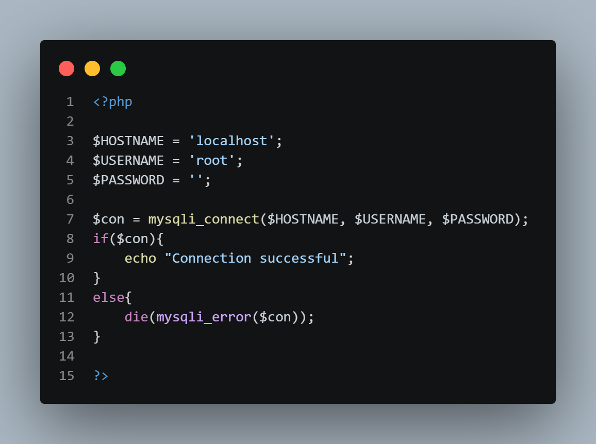


- **new mysqli**

Create a variable object `new`
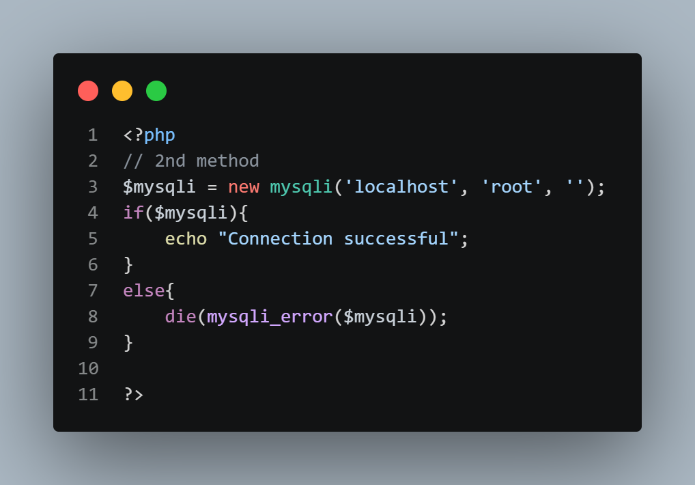

- **define()**

`define()` - defines a constant (values that can't be changed but can be accessed across the code)

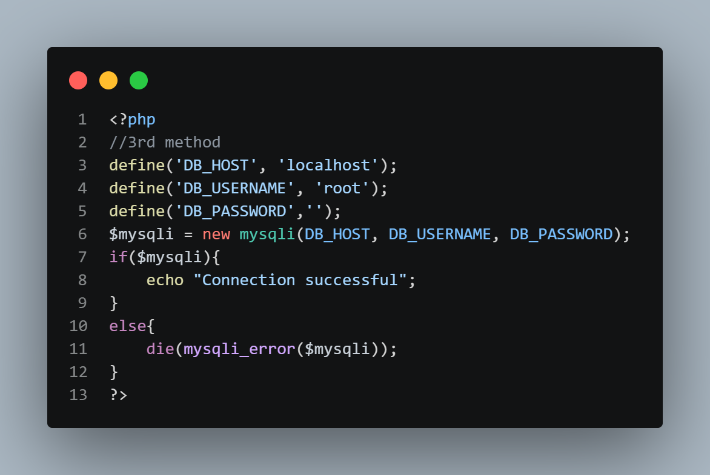

[connection.php](./connection.php)

## 2. Create a Database
- First connect to the database
- Make SQL query to connect to the database 
- Pass two parameters in `mysqli_query()`,  *server connection* and *database creation sql*.

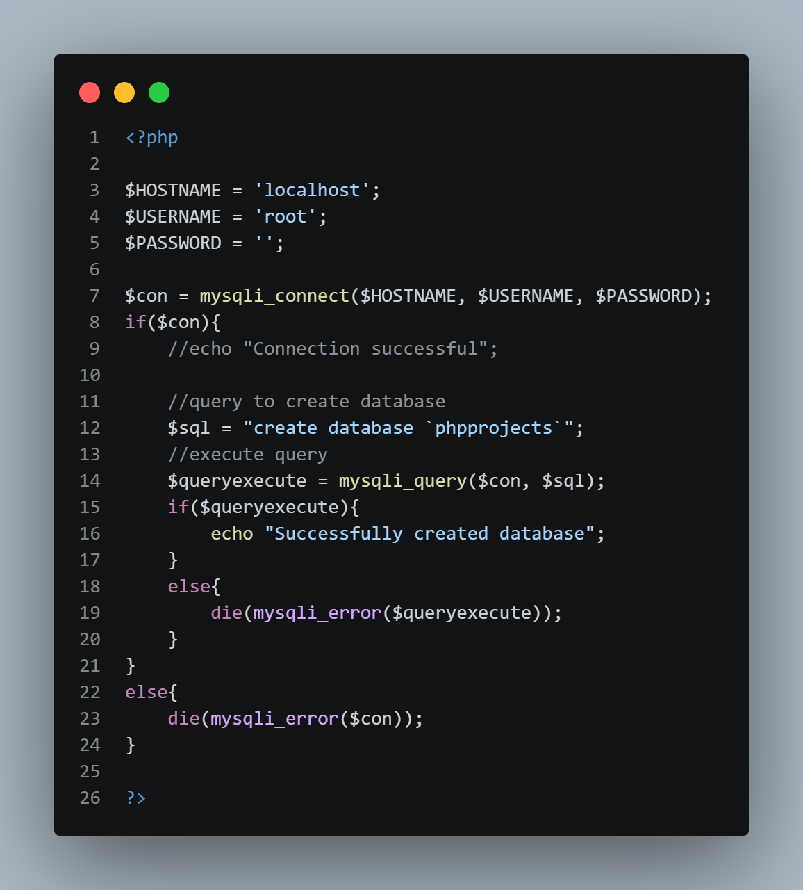

[create.php](./create.php)

## 3. Create Tables
- Use Sql query to create tables

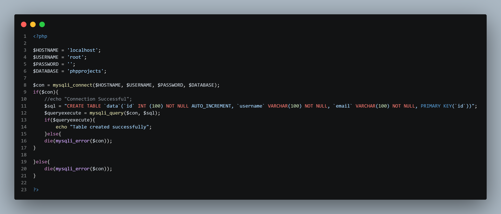

[createtable.php](./createtable.php)

## 4. Insert data in Table of the database

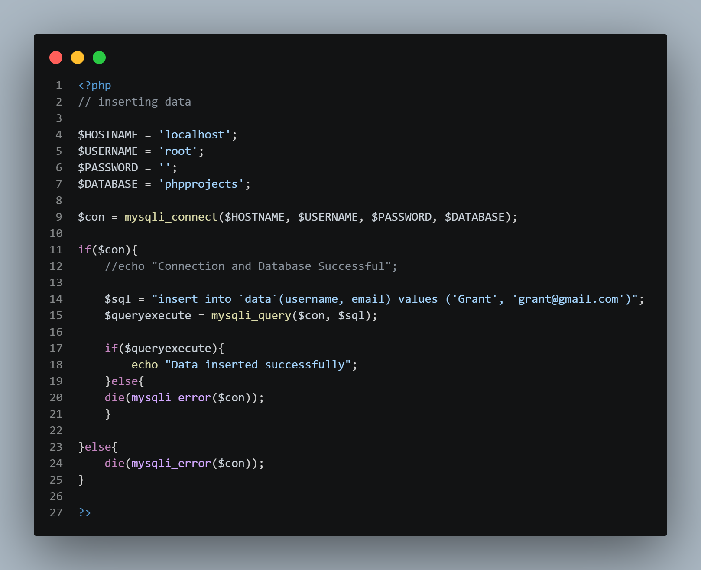

[insert.php](./insert.php)


## 5. Updating data

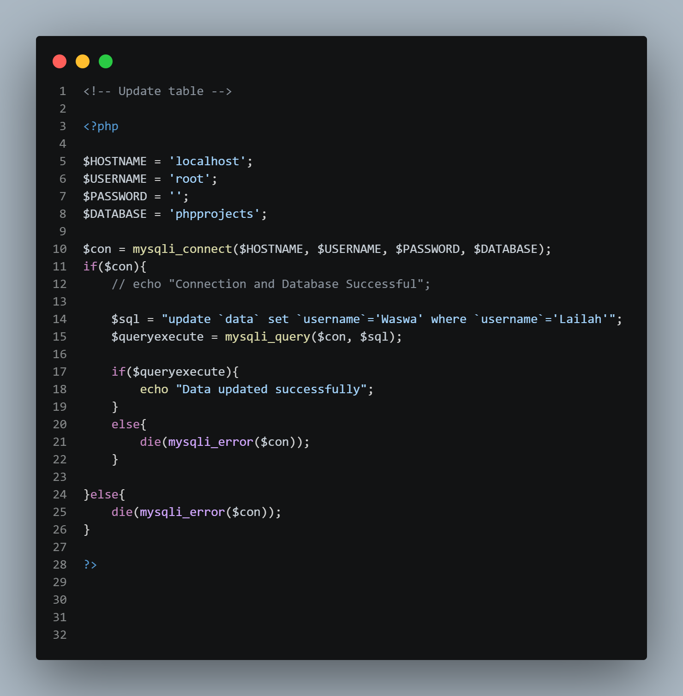

[update.php](./update.php)


## 6. Alter table data

> To make changes in the table like `adding columns`, `deleting columns`, etc.

a) To remove the email column, use the following query:

```php
$sql = "alter table `data` drop column `email`";
```

- `drop column` deletes the whole column in a table

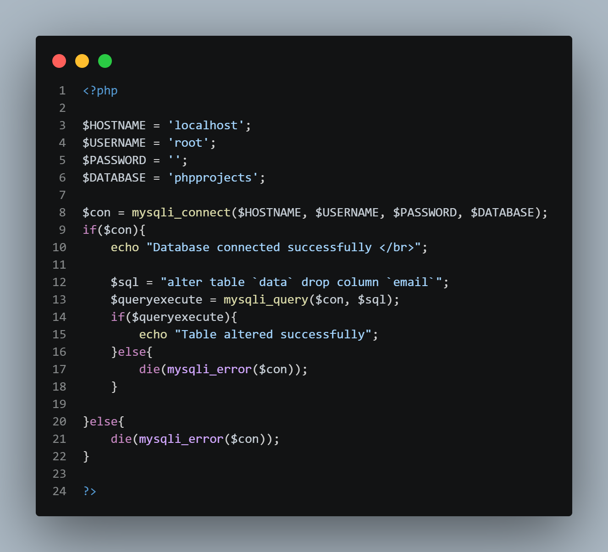

[alter.php](./alter.php)


b) To add columns in the table, use the following query:

```php
$sql = "alter table `data` add email VARCHAR(100)";
```

- `add` - adds the column

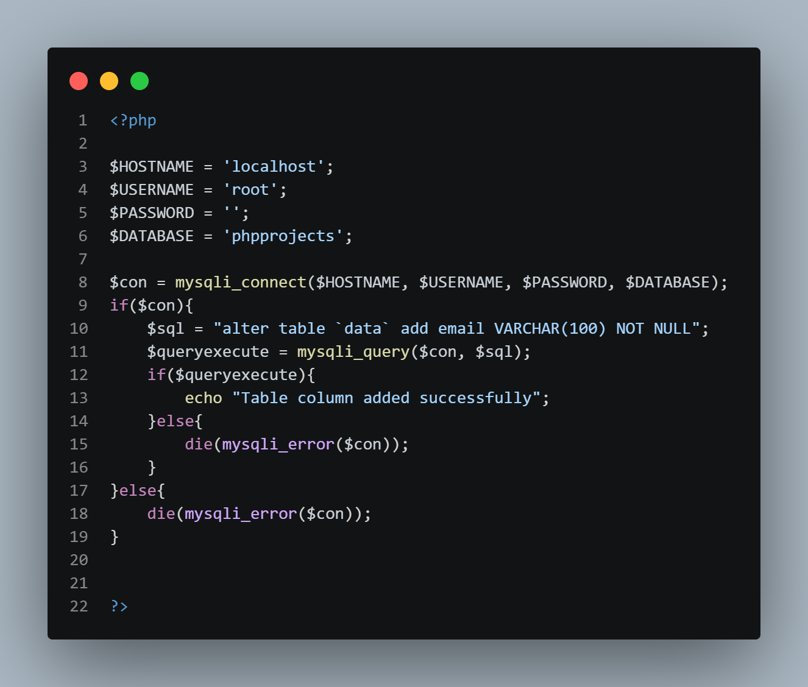

[alter-add.php](./alter-add.php)


## 7. Delete data 

> Use `id` to delete specific data from the table

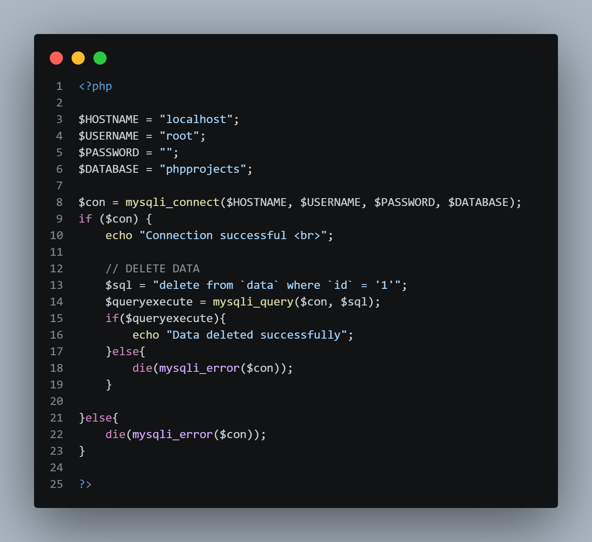

[delete.php](delete.php)


## 8. Form data

> How to insert data from a form to a database

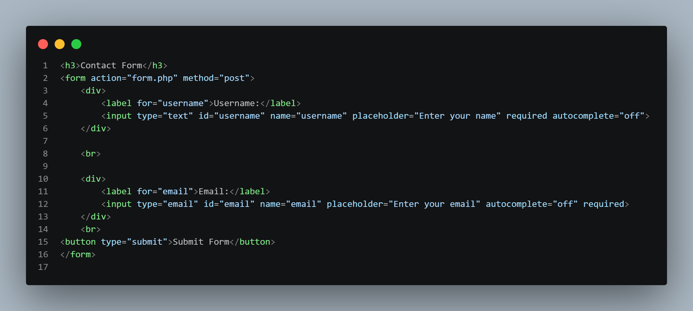

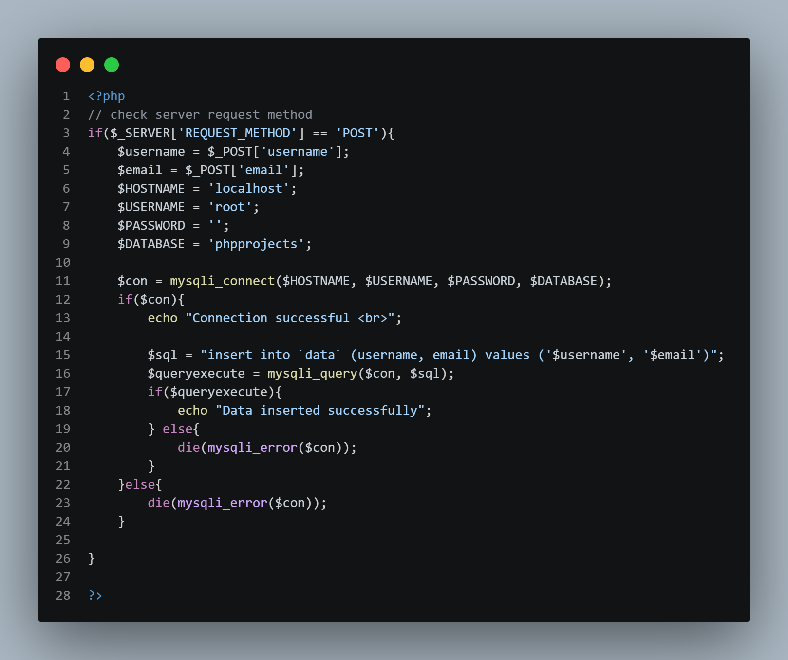

[form.php](./form.php)


